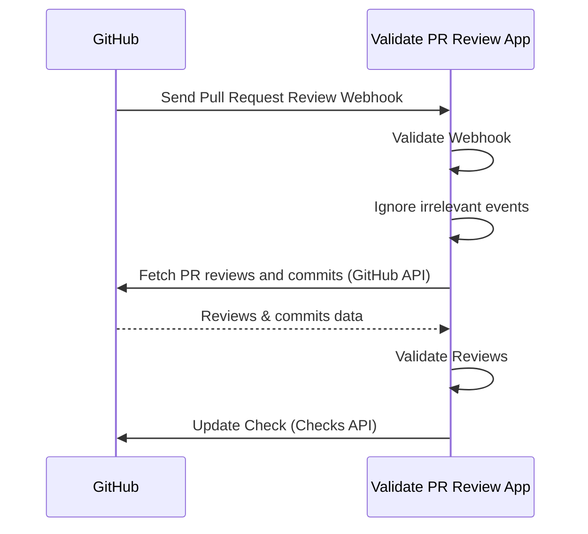

# Validate PR Review App

Validate PR Review App is a self-hosted GitHub App that validates Pull Request reviews.
It helps organizations improve governance and security by ensuring PRs cannot be merged without proper approvals while keeping developer experience.


## :warning: Status

This project is still in alpha.
Probably this doesn't work.
Please don't use this yet.

## Features

- Security and Governance
  - Enforce Pull Request reviews
  - Centralized configuration: Manage settings in one place via the GitHub App, keeping governance and security strong with minimal overhead.
- Good Developer Experience
  - Runs quickly and provides clear error feedback through the Checks API, so developers immediately understand why validation failed.

### Validation Rules

- At least **1 approval** required.
- If the committer approves → **2 approvals required**.
- If the PR contains unsigned commits or commits not linked to a GitHub user → **2 approvals required**.
- Approvals from untrusted Machine Users or GitHub Apps are ignored.
- If the PR contains commits from untrusted Machine Users or GitHub Apps → **2 approvals required**.

## How It Works

1. Install the GitHub App in your repositories and [enable Webhook](https://docs.github.com/en/apps/creating-github-apps/registering-a-github-app/using-webhooks-with-github-apps).
2. GitHub sends Webhook to the App when pull requests are reviewed.
3. The App validates if the Webhook is valid.
4. The App filters irrevant events like review comments.
5. The App fetches PR reviews and commits using the GitHub API.
6. The App validates reviews.
7. The App updates the Check via the Checks API.



## Why?

This project is the successor to the following our OSS Projects:

1. [deny-self-approve](https://github.com/suzuki-shunsuke/deny-self-approve) (CLI)
2. [validate-pr-review-action](https://github.com/suzuki-shunsuke/validate-pr-review-action) (GitHub Action)

When developing as a team, it's common to require that pull requests be reviewed by someone other than the author.
Code reviews help improve code quality, facilitate knowledge sharing among team members, and prevent any single person from making unauthorized changes without approval.

First, you should enable the following branch ruleset on the default branch.

- `Require a pull request before merging`
  - `Require review from Code Owners`
  - `Require approval of the most recent reviewable push`
- `Require status checks to pass`

This rules require pull request reviews, but there are still several ways to improperly merge a pull request without a valid review:

1. Abusing a machine user with `CODEOWNER` privileges to approve the PR.
2. Adding commits to someone else’s PR and approving it yourself.
3. Using a machine user or bot to add commits to someone else’s PR, then approving it yourself.

[validate-pr-review-action](https://github.com/suzuki-shunsuke/validate-pr-review-action) validates pull request reviews via `pull_request_review` or `merge_group` events.
While GitHub Actions-based validation works for small projects, it doesn’t scale well for larger organizations due to:

- **Setup & management cost**
  - Workflows must be added and maintained in every repository.
  - Required Workflows don’t support the `pull_request_review` event.
- **Security & governance**
  - Easy to bypass by editing workflows.
  - Hard to centrally manage trusted apps or settings.
- **Developer experience**
  - Slower execution compared to FaaS (serverless).
  - Workflows trigger unnecessarily (e.g., on review comments).
  - Poor error visibility (logs instead of clear feedback).

**Validate PR Review App** solves these issues by working as a GitHub App, receiving Webhooks, and updating Checks directly.

## Supported Platforms

Now only AWS Lambda is supported.

## Setup

> [!WARNING]
> We will release pre-built binaries for AWS Lambda to GitHub Releases.
> Now you need to build them yourself.

- [Generate a Webhook Secret Token](https://docs.github.com/en/webhooks/using-webhooks/validating-webhook-deliveries).
- Create a dedicated GitHub App with:
  - Permissions:
    - `checks:write`
    - `pull_requests:read`
    - `contents:read`
  - Private Key (keep safe).
- Deploy Validate PR Review App.
- Store Webhook Secret & GitHub App Private Key in **AWS Secrets Manager**.
- Enable Webhooks in your GitHub App:
  - Set the Webhook Secret.
  - Point the Webhook URL to your Lambda.
- Install the App in repositories to validate PRs.

## Configuration

Configuration consists of **secrets** and **non-secrets**.

### Secrets

- `webhook_secret`
- `github_app_private_key`

> [!WARNING]
> When using AWS Secrets Manager Web UI, multi-line values are not supported.
> You should convert the private key and webhook secret into JSON before storing.

### Example Config

```yaml
app_id: 0000 # GitHub App ID
installation_id: 00000000 # GitHub App Installation ID
aws:
  secret_id: request-pr-review-app # Secret ID in AWS Secrets Manager
  use_lambda_function_url: true # true when using Lambda Function URL
check_name: check-approval # Optional. Default: validate-review
trusted_apps:
  - renovate
  - dependabot
untrusted_machine_users:
  - "*-bot"
  - octocat
trusted_machine_users:
  - suzuki-shunsuke-bot
```

## Trusted vs. Untrusted Users and GitHub Apps

- **Trusted Apps & Users**: properly managed, cannot be abused.
- **Untrusted Apps & Users**: potentially exploitable (e.g., private keys exposed).

By default:

- `renovate` and `dependabot` are trusted Apps.
- Machine Users are trusted unless configured otherwise.
  - This is because machine users can't be distinguished with normal users without configuration.

Example:

```yaml
trusted_apps:
  - renovate
  - dependabot
untrusted_machine_users:
  - "*-bot"
trusted_machine_users:
  - my-safe-bot
```

## Demo

- Approve a PR created by Renovate or Dependabot → Check passes.
- Dismiss a review → Check fails.
- Add a commit yourself and approve → Check fails (self-approval detected).
- Leave a review comment → No Check update.

## Logging, Monitoring, Security, etc

Please see the following documents:

- AWS Lambda
  - [Sending Lambda function logs to CloudWatch Logs](https://docs.aws.amazon.com/lambda/latest/dg/monitoring-cloudwatchlogs.html)
  - [Monitoring, debugging, and troubleshooting Lambda functions](https://docs.aws.amazon.com/lambda/latest/dg/lambda-monitoring.html)
- GitHub App
  - [Validating webhook deliveries](https://docs.github.com/en/webhooks/using-webhooks/validating-webhook-deliveries)

## License

[MIT](LICENSE)
