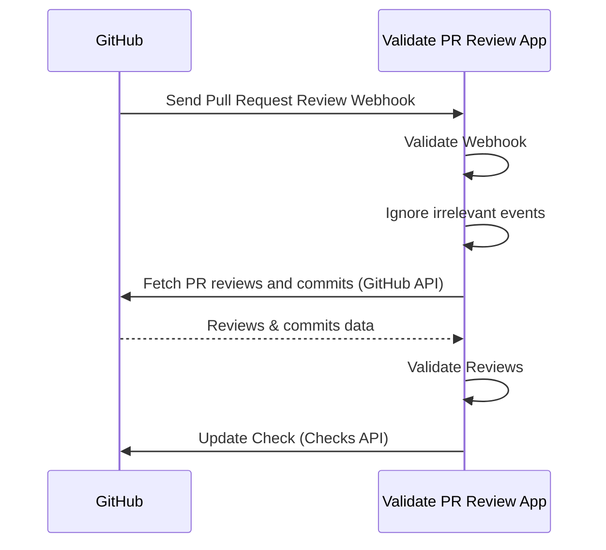

# Validate PR Review App

[![DeepWiki](https://img.shields.io/badge/DeepWiki-suzuki--shunsuke%2Fvalidate--pr--review--app-blue.svg?logo=data:image/png;base64,iVBORw0KGgoAAAANSUhEUgAAACwAAAAyCAYAAAAnWDnqAAAAAXNSR0IArs4c6QAAA05JREFUaEPtmUtyEzEQhtWTQyQLHNak2AB7ZnyXZMEjXMGeK/AIi+QuHrMnbChYY7MIh8g01fJoopFb0uhhEqqcbWTp06/uv1saEDv4O3n3dV60RfP947Mm9/SQc0ICFQgzfc4CYZoTPAswgSJCCUJUnAAoRHOAUOcATwbmVLWdGoH//PB8mnKqScAhsD0kYP3j/Yt5LPQe2KvcXmGvRHcDnpxfL2zOYJ1mFwrryWTz0advv1Ut4CJgf5uhDuDj5eUcAUoahrdY/56ebRWeraTjMt/00Sh3UDtjgHtQNHwcRGOC98BJEAEymycmYcWwOprTgcB6VZ5JK5TAJ+fXGLBm3FDAmn6oPPjR4rKCAoJCal2eAiQp2x0vxTPB3ALO2CRkwmDy5WohzBDwSEFKRwPbknEggCPB/imwrycgxX2NzoMCHhPkDwqYMr9tRcP5qNrMZHkVnOjRMWwLCcr8ohBVb1OMjxLwGCvjTikrsBOiA6fNyCrm8V1rP93iVPpwaE+gO0SsWmPiXB+jikdf6SizrT5qKasx5j8ABbHpFTx+vFXp9EnYQmLx02h1QTTrl6eDqxLnGjporxl3NL3agEvXdT0WmEost648sQOYAeJS9Q7bfUVoMGnjo4AZdUMQku50McDcMWcBPvr0SzbTAFDfvJqwLzgxwATnCgnp4wDl6Aa+Ax283gghmj+vj7feE2KBBRMW3FzOpLOADl0Isb5587h/U4gGvkt5v60Z1VLG8BhYjbzRwyQZemwAd6cCR5/XFWLYZRIMpX39AR0tjaGGiGzLVyhse5C9RKC6ai42ppWPKiBagOvaYk8lO7DajerabOZP46Lby5wKjw1HCRx7p9sVMOWGzb/vA1hwiWc6jm3MvQDTogQkiqIhJV0nBQBTU+3okKCFDy9WwferkHjtxib7t3xIUQtHxnIwtx4mpg26/HfwVNVDb4oI9RHmx5WGelRVlrtiw43zboCLaxv46AZeB3IlTkwouebTr1y2NjSpHz68WNFjHvupy3q8TFn3Hos2IAk4Ju5dCo8B3wP7VPr/FGaKiG+T+v+TQqIrOqMTL1VdWV1DdmcbO8KXBz6esmYWYKPwDL5b5FA1a0hwapHiom0r/cKaoqr+27/XcrS5UwSMbQAAAABJRU5ErkJggg==)](https://deepwiki.com/suzuki-shunsuke/validate-pr-review-app)

Validate PR Review App is a self-hosted GitHub App that validates Pull Request reviews.
It helps organizations improve governance and security by ensuring PRs cannot be merged without proper approvals while keeping developer experience.


## Features

- Security and Governance
  - Enforce Pull Request reviews
  - Centralized configuration: Manage settings in one place via the GitHub App, keeping governance and security strong with minimal overhead.
- Good Developer Experience
  - Runs quickly and provides clear error feedback through the Checks API, so developers immediately understand why validation failed.

### Validation Rules

- At least **1 approval** required.
- If the committer approves → **2 approvals required**.
- If the PR contains [unsigned commits](https://docs.github.com/en/authentication/managing-commit-signature-verification/signing-commits) or [commits not linked to a GitHub user](https://docs.github.com/en/pull-requests/committing-changes-to-your-project/troubleshooting-commits/why-are-my-commits-linked-to-the-wrong-user) → **2 approvals required**.
- Approvals from untrusted Machine Users or GitHub Apps are ignored.
- If the PR contains commits from untrusted Machine Users or GitHub Apps → **2 approvals required**.

## How It Works

1. Install the GitHub App in your repositories and [enable Webhook](https://docs.github.com/en/apps/creating-github-apps/registering-a-github-app/using-webhooks-with-github-apps).
2. GitHub sends Webhook to the App when pull requests are reviewed or pull requests are added to merge queue.
3. The App validates if the Webhook is valid.
4. The App filters irrevant events like review comments.
5. The App fetches PR reviews and commits using the GitHub API.
6. The App validates reviews.
7. The App updates the Check via the Checks API.



## Why?

This project is the successor to the following our OSS Projects:

1. [deny-self-approve](https://github.com/suzuki-shunsuke/deny-self-approve) (CLI)
2. [validate-pr-review-action](https://github.com/suzuki-shunsuke/validate-pr-review-action) (GitHub Action)

When developing as a team, it's common to require that pull requests be reviewed by someone other than the author.
Code reviews help improve code quality, facilitate knowledge sharing among team members, and prevent any single person from making unauthorized changes without approval.

First, you should enable the following branch ruleset on the default branch.

- `Require a pull request before merging`
  - `Require review from Code Owners`
  - `Require approval of the most recent reviewable push`
- `Require status checks to pass`

This rules require pull request reviews, but there are still several ways to improperly merge a pull request without a valid review:

1. Abusing a machine user with `CODEOWNER` privileges to approve the PR.
2. Adding commits to someone else’s PR and approving it yourself.
3. Using a machine user or bot to add commits to someone else’s PR, then approving it yourself.

[validate-pr-review-action](https://github.com/suzuki-shunsuke/validate-pr-review-action) validates pull request reviews via `pull_request_review` or `merge_group` events.
While GitHub Actions-based validation works for small projects, it doesn’t scale well for larger organizations due to:

- **Setup & management cost**
  - Workflows must be added and maintained in every repository.
  - Required Workflows don’t support the `pull_request_review` event.
- **Security & governance**
  - Easy to bypass by editing workflows.
  - Hard to centrally manage trusted apps or settings.
- **Developer experience**
  - Slower execution compared to FaaS (serverless).
  - Workflows trigger unnecessarily (e.g., on review comments).
  - Poor error visibility (logs instead of clear feedback).

**Validate PR Review App** solves these issues by working as a GitHub App, receiving Webhooks, and updating Checks directly.

## Supported Platforms

- AWS Lambda
  - Function URL
  - Amazon API Gateway
- HTTP Server

## Getting Started

- [Run HTTP Server in your localhost](docs/getting-started/http.md)
- [AWS Lambda](docs/getting-started/lambda.md)

## Merge Queue Support

This app supports [Merge Queue](https://docs.github.com/en/repositories/configuring-branches-and-merges-in-your-repository/configuring-pull-request-merges/managing-a-merge-queue).
Additional settings aren't necessary.

## Trusted vs. Untrusted Users and GitHub Apps

- **Trusted Apps & Users**: properly managed, cannot be abused.
- **Untrusted Apps & Users**: potentially exploitable (e.g., private keys exposed).

By default:

- `renovate` and `dependabot` are trusted Apps.
- Machine Users are trusted unless configured otherwise.
  - This is because machine users can't be distinguished with normal users without configuration.

Example:

```yaml
trusted_apps:
  - renovate
  - dependabot
untrusted_machine_users:
  - "*-bot"
trusted_machine_users:
  - my-safe-bot
```

## Using CSM Actions For Secure Automatic Code Fixes and Approvals

By using the **Validate PR Review App**, you can prevent commits and approvals made by untrusted Apps or Machine Users.
However, requiring two approvals every time CI automatically fixes code can hurt developer productivity.

[**CSM Actions**](https://github.com/csm-actions/docs) solves this problem.
CSM Actions is a collection of GitHub Actions that securely handle code modifications and approvals through a **Client/Server Model**.
With this model, sensitive credentials such as a GitHub App’s Private Key or a Machine User’s Personal Access Token never need to be passed to the client side (regular GitHub Actions workflows). Instead, they are securely managed on the server side (a centrally managed GitHub repository and workflow).

Here are some available Actions:

- [**Securefix Action**](https://github.com/csm-actions/securefix-action): Securely create commits and pull requests.
- [**Approve PR Action**](https://github.com/csm-actions/approve-pr-action): Securely approve PRs using a Machine User.
- [**Update Branch Action**](https://github.com/csm-actions/update-branch-action): Securely update PR branches.
  - If a reviewer updates a branch from the GitHub Web UI, another reviewer’s approval is required to prevent self-approval. With Update Branch Action, the branch is updated securely using a GitHub App.

By registering the Apps or Machine Users used with CSM Actions in `trusted_apps` or `untrusted_machine_users`, you can achieve automatic code fixes and auto-merge without additional PR reviews.

## See Also

- [Verify Release Assets](docs/verify-asset.md)
- [Verify Container Images](docs/verify-image.md)
- [GitHub App Settings](docs/github-app.md)
- [Configuration](docs/config.md)
- [Logging, Monitoring, and Security](docs/production.md)

## License

[MIT](LICENSE)
