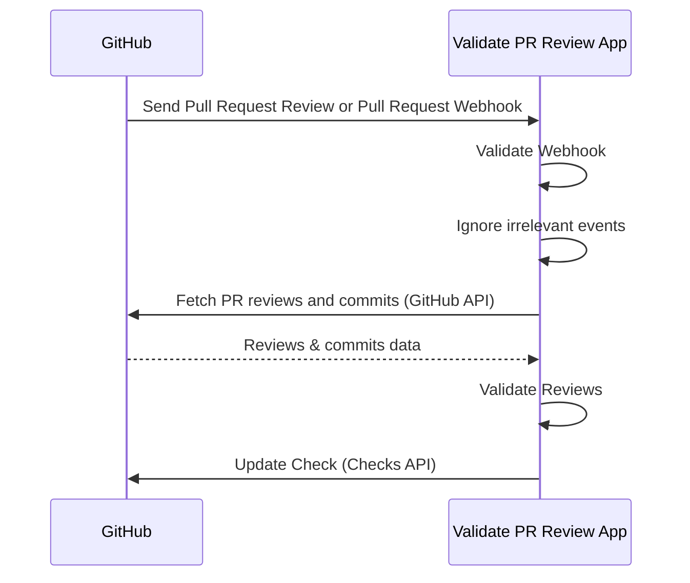

# Validate PR Review App

[](https://deepwiki.com/suzuki-shunsuke/validate-pr-review-app) [Agent Skills](#agent-skills)

Validate PR Review App is a self-hosted GitHub App that validates Pull Request reviews.
It helps organizations improve governance and security by ensuring PRs cannot be merged without proper approvals while keeping developer experience.


## Features

- Security and Governance
  - Enforce Pull Request reviews
  - Centralized configuration: Manage settings in one place via the GitHub App, keeping governance and security strong with minimal overhead.
- Good Developer Experience
  - Runs quickly and provides clear error feedback through the Checks API, so developers immediately understand why validation failed.

### Validation Rules

- At least **1 approval** is required.
- A **2nd approval** is required when a change carries more risk — for example when the committer approves their own PR, when the PR contains unsigned commits or commits not linked to a GitHub user, or when it involves untrusted Machine Users or GitHub Apps.
- Approvals from untrusted Machine Users or GitHub Apps are ignored.

[See the validation skill for the full rules, how the app works, and how empty/trivial merge commits and Pull Request events are handled.](skills/validate-pr-review-app-validation/reference.md)

## How It Works

1. Install the GitHub App in your repositories and [enable Webhook](https://docs.github.com/en/apps/creating-github-apps/registering-a-github-app/using-webhooks-with-github-apps).
2. GitHub sends Webhook to the App when pull requests are reviewed or pull requests are added to merge queue.
3. The App validates if the Webhook is valid.
4. The App filters irrevant events like review comments.
5. The App fetches PR reviews and commits using the GitHub API.
6. The App validates reviews.
7. The App updates the Check via the Checks API.


```mermaid
sequenceDiagram
    participant GitHub
    participant ValidatePRReviewApp as Validate PR Review App

    GitHub ->> ValidatePRReviewApp: Send Pull Request Review or Pull Request Webhook
    ValidatePRReviewApp ->> ValidatePRReviewApp: Validate Webhook
    ValidatePRReviewApp ->> ValidatePRReviewApp: Ignore irrelevant events
    ValidatePRReviewApp ->> GitHub: Fetch PR reviews and commits (GitHub API)
    GitHub -->> ValidatePRReviewApp: Reviews & commits data
    ValidatePRReviewApp ->> ValidatePRReviewApp: Validate Reviews
    ValidatePRReviewApp ->> GitHub: Update Check (Checks API)
```

## Why?

This project is the successor to the following our OSS Projects:

1. [deny-self-approve](https://github.com/suzuki-shunsuke/deny-self-approve) (CLI)
2. [validate-pr-review-action](https://github.com/suzuki-shunsuke/validate-pr-review-action) (GitHub Action)

When developing as a team, it's common to require that pull requests be reviewed by someone other than the author.
Code reviews help improve code quality, facilitate knowledge sharing among team members, and prevent any single person from making unauthorized changes without approval.

First, you should enable the following branch ruleset on the default branch.

- `Require a pull request before merging`
  - `Require review from Code Owners`
  - `Require approval of the most recent reviewable push`
- `Require status checks to pass`

This rules require pull request reviews, but there are still several ways to improperly merge a pull request without a valid review:

1. Abusing a machine user with `CODEOWNER` privileges to approve the PR.
2. Adding commits to someone else’s PR and approving it yourself.
3. Using a machine user or bot to add commits to someone else’s PR, then approving it yourself.

[validate-pr-review-action](https://github.com/suzuki-shunsuke/validate-pr-review-action) validates pull request reviews via `pull_request_review` or `merge_group` events.
While GitHub Actions-based validation works for small projects, it doesn’t scale well for larger organizations due to:

- **Setup & management cost**
  - Workflows must be added and maintained in every repository.
  - Required Workflows don’t support the `pull_request_review` event.
- **Security & governance**
  - Easy to bypass by editing workflows.
  - Hard to centrally manage trusted apps or settings.
- **Developer experience**
  - Slower execution compared to FaaS (serverless).
  - Workflows trigger unnecessarily (e.g., on review comments).
  - Poor error visibility (logs instead of clear feedback).

**Validate PR Review App** solves these issues by working as a GitHub App, receiving Webhooks, and updating Checks directly.

## Supported Platforms

- AWS Lambda
  - Function URL
  - Amazon API Gateway
- HTTP Server

## Getting Started

- [Run HTTP Server in your localhost](docs/getting-started/http.md)
- [AWS Lambda](docs/getting-started/lambda.md)

## Agent Skills

[About Agent Skills, please see the official document.](https://agentskills.io/home)

This repository provides Agent Skills under [skills/](skills):

- [validate-pr-review-app-validation](skills/validate-pr-review-app-validation/SKILL.md) — how PR review validation works, why approvals are required, and how empty/trivial merge commits and Pull Request events are handled
- [validate-pr-review-app-configuration](skills/validate-pr-review-app-configuration/SKILL.md) — configure the app (trust model, secrets, environment variables, footer, unsigned commits)
- [validate-pr-review-app-github-app](skills/validate-pr-review-app-github-app/SKILL.md) — register and set up the GitHub App
- [validate-pr-review-app-operations](skills/validate-pr-review-app-operations/SKILL.md) — HTTP endpoints, logging, and monitoring
- [validate-pr-review-app-verify-assets](skills/validate-pr-review-app-verify-assets/SKILL.md) — verify release assets and container images

Install a skill using [vercel-labs/skills](https://github.com/vercel-labs/skills):

```sh
npx skills add suzuki-shunsuke/validate-pr-review-app --skill validate-pr-review-app-validation
```

## Merge Queue Support

This app supports [Merge Queue](https://docs.github.com/en/repositories/configuring-branches-and-merges-in-your-repository/configuring-pull-request-merges/managing-a-merge-queue) with no additional settings. [See the validation skill.](skills/validate-pr-review-app-validation/reference.md)

## Trusted vs. Untrusted Users and GitHub Apps

Trusted Apps and Users are properly managed and cannot be abused; untrusted ones are potentially exploitable, so their approvals are ignored and their commits require a second approval.
By default, `renovate` and `dependabot` are trusted Apps, and Machine Users are trusted unless configured otherwise.

[See the configuration skill to configure `trusted_apps` and `untrusted_machine_users`.](skills/validate-pr-review-app-configuration/reference.md)

## Using CSM Actions For Secure Automatic Code Fixes and Approvals

Requiring two approvals every time CI automatically fixes code can hurt developer productivity.
[**CSM Actions**](https://github.com/csm-actions/docs) solves this with a **Client/Server Model** that keeps sensitive credentials on the server side, so automatic code fixes and approvals don't need extra reviews.
By registering the Apps or Machine Users it uses in `trusted_apps` or `untrusted_machine_users`, you can achieve automatic code fixes and auto-merge without additional PR reviews.

[See the validation skill for details.](skills/validate-pr-review-app-validation/reference.md)

## See Also

- [Validation](skills/validate-pr-review-app-validation/reference.md)
- [Configuration](skills/validate-pr-review-app-configuration/reference.md)
- [GitHub App Settings](skills/validate-pr-review-app-github-app/reference.md)
- [Operations (HTTP endpoints, Logging, Monitoring, Security)](skills/validate-pr-review-app-operations/reference.md)
- [Verify Release Assets and Container Images](skills/validate-pr-review-app-verify-assets/reference.md)

## License

[MIT](LICENSE)
