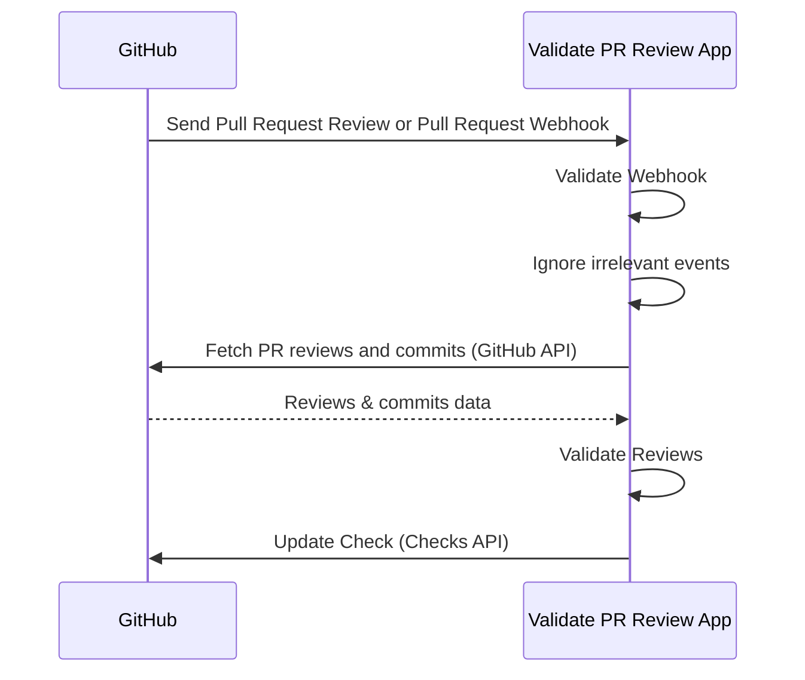

## How It Works

1. Install the GitHub App in your repositories and [enable Webhook](https://docs.github.com/en/apps/creating-github-apps/registering-a-github-app/using-webhooks-with-github-apps).
2. GitHub sends Webhook to the App when pull requests are reviewed or pull requests are added to merge queue.
3. The App validates if the Webhook is valid.
4. The App filters irrevant events like review comments.
5. The App fetches PR reviews and commits using the GitHub API.
6. The App validates reviews.
7. The App updates the Check via the Checks API.

