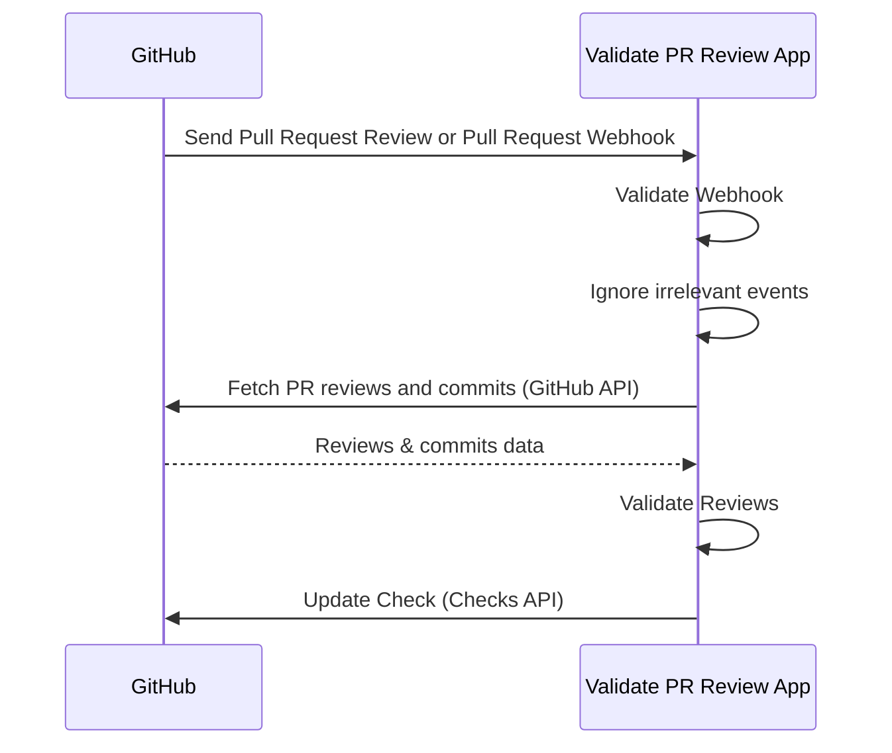

# Overview

Validate PR Review App is a self-hosted GitHub App that validates Pull Request reviews.
It helps organizations improve governance and security by ensuring PRs cannot be merged without
proper approvals while keeping developer experience.

This skill is the entry point: it explains what the app is, how it works end to end, and why it
exists. For details on specific topics, see the sibling skills:

- validate-pr-review-app-validation — the validation rules and behavior (why 1 or 2 approvals, Pull Request events, empty/trivial merge commits).
- validate-pr-review-app-configuration — configuring the app (trust model, secrets, environment variables).
- validate-pr-review-app-github-app — registering and setting up the GitHub App.
- validate-pr-review-app-operations — HTTP endpoints, logging, and monitoring.
- validate-pr-review-app-verify-assets — verifying release assets and container images.

## How It Works

1. Install the GitHub App in your repositories and [enable Webhook](https://docs.github.com/en/apps/creating-github-apps/registering-a-github-app/using-webhooks-with-github-apps).
2. GitHub sends Webhook to the App when pull requests are reviewed or pull requests are added to merge queue.
3. The App validates if the Webhook is valid.
4. The App filters irrelevant events like review comments.
5. The App fetches PR reviews and commits using the GitHub API.
6. The App validates reviews.
7. The App updates the Check via the Checks API.

## Supported Platforms

- AWS Lambda
  - Function URL
  - Amazon API Gateway
- HTTP Server

## Why?

This project is the successor to the following our OSS Projects:

1. [deny-self-approve](https://github.com/suzuki-shunsuke/deny-self-approve) (CLI)
2. [validate-pr-review-action](https://github.com/suzuki-shunsuke/validate-pr-review-action) (GitHub Action)

When developing as a team, it's common to require that pull requests be reviewed by someone other than the author.
Code reviews help improve code quality, facilitate knowledge sharing among team members, and prevent any single person from making unauthorized changes without approval.

First, you should enable the following branch ruleset on the default branch.

- `Require a pull request before merging`
  - `Require review from Code Owners`
  - `Require approval of the most recent reviewable push`
- `Require status checks to pass`

This rules require pull request reviews, but there are still several ways to improperly merge a pull request without a valid review:

1. Abusing a machine user with `CODEOWNER` privileges to approve the PR.
2. Adding commits to someone else's PR and approving it yourself.
3. Using a machine user or bot to add commits to someone else's PR, then approving it yourself.

[validate-pr-review-action](https://github.com/suzuki-shunsuke/validate-pr-review-action) validates pull request reviews via `pull_request_review` or `merge_group` events.
While GitHub Actions-based validation works for small projects, it doesn't scale well for larger organizations due to:

- **Setup & management cost**
  - Workflows must be added and maintained in every repository.
  - Required Workflows don't support the `pull_request_review` event.
- **Security & governance**
  - Easy to bypass by editing workflows.
  - Hard to centrally manage trusted apps or settings.
- **Developer experience**
  - Slower execution compared to FaaS (serverless).
  - Workflows trigger unnecessarily (e.g., on review comments).
  - Poor error visibility (logs instead of clear feedback).

**Validate PR Review App** solves these issues by working as a GitHub App, receiving Webhooks, and updating Checks directly.
