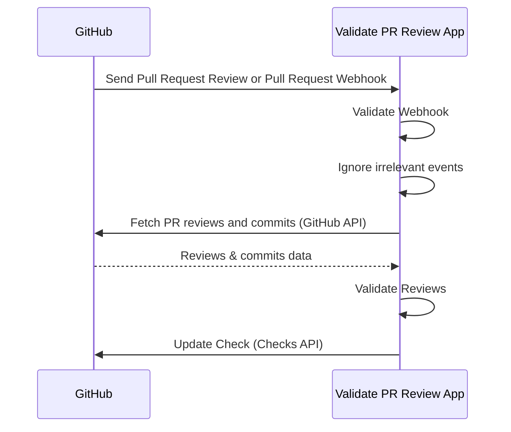

Validate PR Review App is a self-hosted GitHub App that validates Pull Request reviews.
It helps organizations improve governance and security by ensuring PRs cannot be merged without proper approvals while keeping developer experience.

## Features

- Security and Governance
  - Enforce Pull Request reviews
  - Centralized configuration: Manage settings in one place via the GitHub App, keeping governance and security strong with minimal overhead.
- Good Developer Experience
  - Runs quickly and provides clear error feedback through the Checks API, so developers immediately understand why validation failed.
  - Works with GitHub Merge Queue with no additional setup.

### Validation Rules

- At least **1 approval** is required.
- A **2nd approval** is required when a change carries more risk — for example when the committer approves their own PR, when the PR contains unsigned commits or commits not linked to a GitHub user, or when it involves untrusted Machine Users or GitHub Apps.
- Approvals from untrusted Machine Users or GitHub Apps are ignored.

## How It Works

1. Install the GitHub App in your repositories and [enable Webhook](https://docs.github.com/en/apps/creating-github-apps/registering-a-github-app/using-webhooks-with-github-apps).
2. GitHub sends Webhook to the App when pull requests are reviewed or pull requests are added to merge queue.
3. The App validates if the Webhook is valid.
4. The App filters irrevant events like review comments.
5. The App fetches PR reviews and commits using the GitHub API.
6. The App validates reviews.
7. The App updates the Check via the Checks API.

## Why?

This project is the successor to [deny-self-approve](https://github.com/suzuki-shunsuke/deny-self-approve) (CLI) and [validate-pr-review-action](https://github.com/suzuki-shunsuke/validate-pr-review-action) (GitHub Action).
Even with branch rulesets that require reviews, PRs can still be merged improperly — for example by abusing a machine user with `CODEOWNER` privileges, or by adding commits to someone else's PR and approving it yourself.
GitHub Actions-based validation doesn't scale well for larger organizations (setup cost, easy to bypass, slower, poor error visibility), so this app solves these issues by working as a GitHub App, receiving Webhooks, and updating Checks directly.

## Supported Platforms

- AWS Lambda
  - Function URL
  - Amazon API Gateway
- HTTP Server
