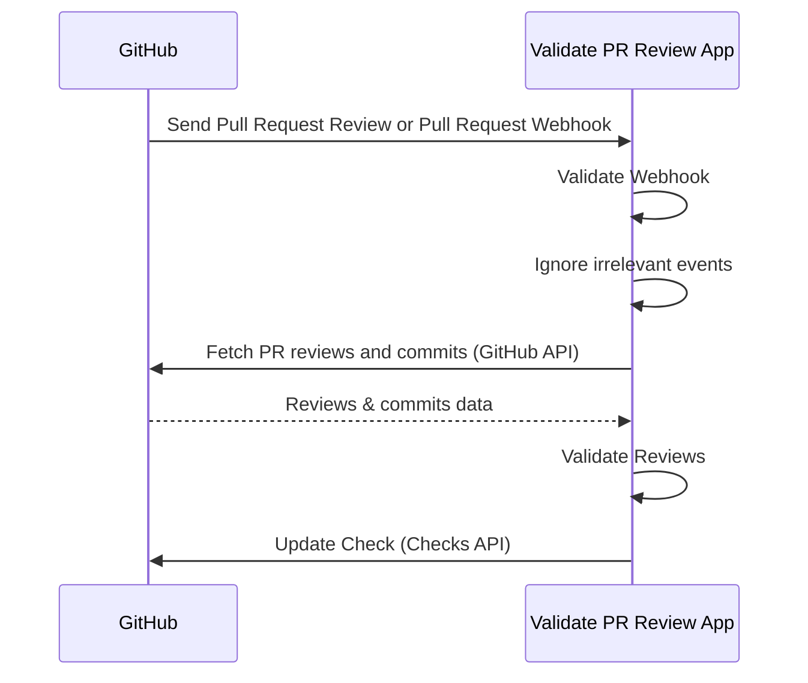

# Validation

Validate PR Review App is a self-hosted GitHub App that validates Pull Request reviews.
It helps organizations improve governance and security by ensuring PRs cannot be merged without
proper approvals while keeping developer experience.

This document explains how it validates Pull Request reviews, and when a PR passes or fails.

## Validation Rules

- At least **1 approval** required.
- If the committer approves → **2 approvals required**.
  - [As of v0.3.2, empty commits and trivial merge commits don't require 2 approvals](trivial_merge_commits.md)
- If the PR contains [unsigned commits](https://docs.github.com/en/authentication/managing-commit-signature-verification/signing-commits) or [commits not linked to a GitHub user](https://docs.github.com/en/pull-requests/committing-changes-to-your-project/troubleshooting-commits/why-are-my-commits-linked-to-the-wrong-user) → **2 approvals required**.
- Approvals from untrusted Machine Users or GitHub Apps are ignored.
- If the PR contains commits from untrusted Machine Users or GitHub Apps → **2 approvals required**.
- [See also Handling Pull Request Events](pull_request_events.md)

Trusted vs. untrusted Machine Users and GitHub Apps are configured in the app's
configuration. See the configuration skill (`skills/validate-pr-review-app-configuration/reference.md`)
for `trusted_apps` and `untrusted_machine_users`.

## How It Works

1. Install the GitHub App in your repositories and [enable Webhook](https://docs.github.com/en/apps/creating-github-apps/registering-a-github-app/using-webhooks-with-github-apps).
2. GitHub sends Webhook to the App when pull requests are reviewed or pull requests are added to merge queue.
3. The App validates if the Webhook is valid.
4. The App filters irrelevant events like review comments.
5. The App fetches PR reviews and commits using the GitHub API.
6. The App validates reviews.
7. The App updates the Check via the Checks API.

## Merge Queue Support

This app supports [Merge Queue](https://docs.github.com/en/repositories/configuring-branches-and-merges-in-your-repository/configuring-pull-request-merges/managing-a-merge-queue).
Additional settings aren't necessary.

## Using CSM Actions For Secure Automatic Code Fixes and Approvals

By using the **Validate PR Review App**, you can prevent commits and approvals made by untrusted Apps or Machine Users.
However, requiring two approvals every time CI automatically fixes code can hurt developer productivity.

[**CSM Actions**](https://github.com/csm-actions/docs) solves this problem.
CSM Actions is a collection of GitHub Actions that securely handle code modifications and approvals through a **Client/Server Model**.
With this model, sensitive credentials such as a GitHub App's Private Key or a Machine User's Personal Access Token never need to be passed to the client side (regular GitHub Actions workflows). Instead, they are securely managed on the server side (a centrally managed GitHub repository and workflow).

Here are some available Actions:

- [**Securefix Action**](https://github.com/csm-actions/securefix-action): Securely create commits and pull requests.
- [**Approve PR Action**](https://github.com/csm-actions/approve-pr-action): Securely approve PRs using a Machine User.
- [**Update Branch Action**](https://github.com/csm-actions/update-branch-action): Securely update PR branches.
  - If a reviewer updates a branch from the GitHub Web UI, another reviewer's approval is required to prevent self-approval. With Update Branch Action, the branch is updated securely using a GitHub App.

By registering the Apps or Machine Users used with CSM Actions in `trusted_apps` or `untrusted_machine_users`, you can achieve automatic code fixes and auto-merge without additional PR reviews.
